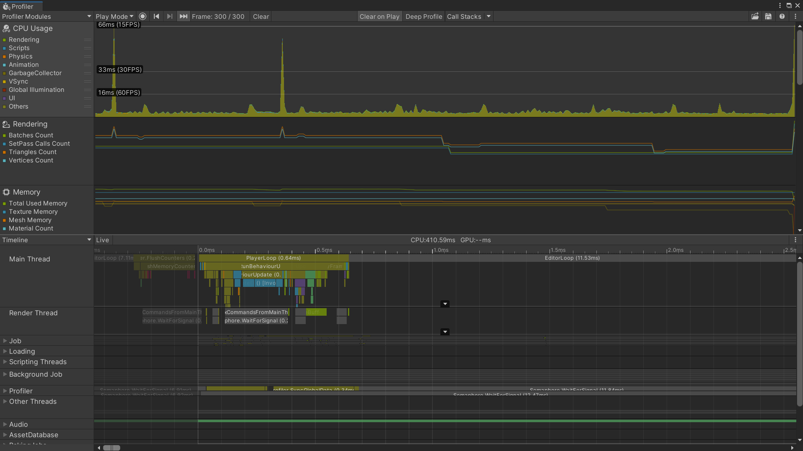
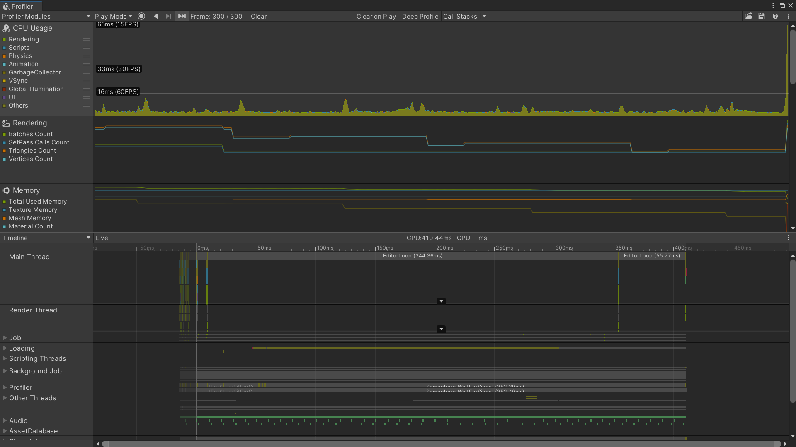

# OPTIMIZATION.md

- Spawning Logic: In `GameManager.cs`, the method `SpawnParticleVfx()` is called on every successful tile tap, which spawns 50 particle VFXs at once:

```csharp
private void SpawnParticleVfx(Vector3 worldPosition)
{
    const int spawnCount = 50;
    for (int i = 0; i < spawnCount; i++)
    {
        GameObject vfx = Instantiate(prefab, ...);
        Destroy(vfx, 3f);
    }
}
```
- This creates massive instantiation cost and activates dozens of heavy ParticleSystems simultaneously.
## Before Optimization:
**Profiler Results (Unoptimized):**
- Severe CPU spikes (up to 40-66ms) when tapping tiles
- High Rendering and Particle System cost
- Heavy impact from spawning 50 complex VFX prefabs per successful tap



## Issues Found:
- **CullingMode** set to `0` (Automatic) on all ParticleSystems
- Extremely high `maxNumParticles` (1000) on multiple systems
- **Trails Module** enabled on several systems (very expensive)
- **Noise Module** set to high quality (3D High)
- `autoRandomSeed = 1` on all systems
- Many overlapping complex modules (Size, Color, Velocity, ClampVelocity, etc.)

## Optimization:

1. **Culling Mode**: Changed from `Automatic` to `Pause` on all ParticleSystems
2. **Max Particles**: Reduced from `1000` to `10`
3. **Trails Module**: Turned off
4. **Noise Module**: Downgraded from **3D High** to **1D Low**

## After Optimization:
**Profiler Results:**
- Slight reduction in CPU spikes and particle-related cost
- Improved culling behavior and lower memory pressure from reduced particle counts
- Overall frame time more stable, but difference is modest / not very noticeable



## Learnings:

- `cullingMode` and `maxNumParticles` matter when many systems are active at once.
- Object Pooling may deliver more significant gains than tweaking individual modules.

## AI Usage:
Used **Claude** and **Grok** to analyze the prefab file, identify expensive modules, and suggest targeted optimization priorities.